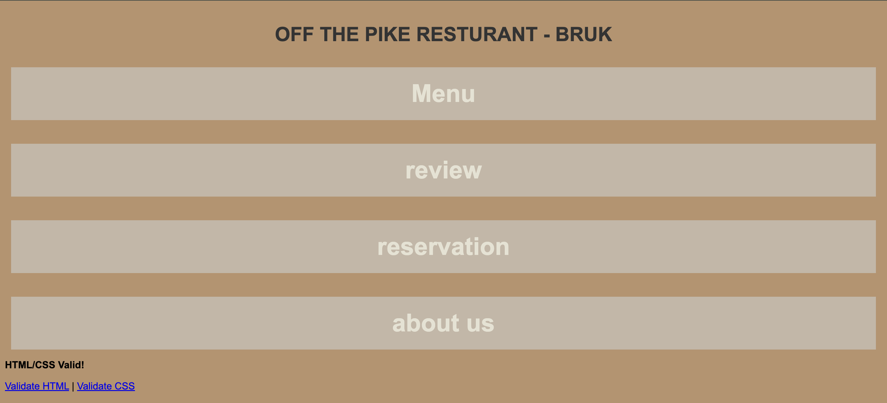
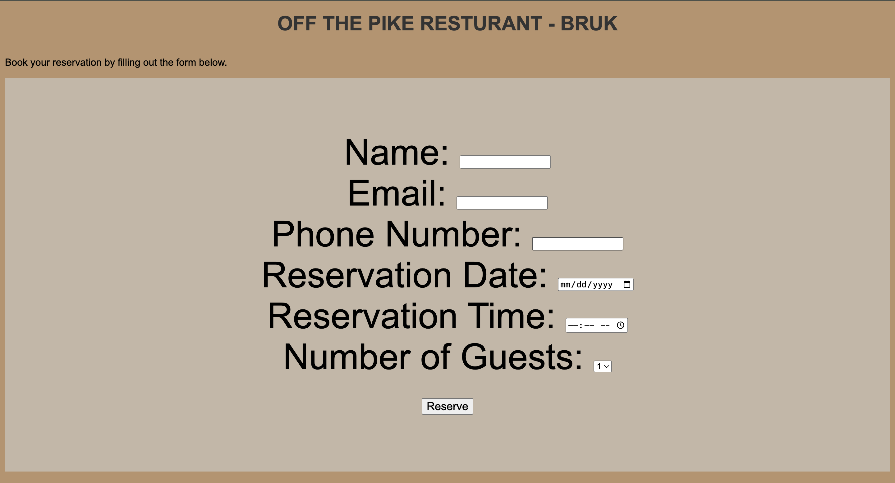

# off the pike  project  

##this project was fun to work on I worked on the main page and the reservation page(form). The hard part was staying in contact with my group

- I used the post method for my form. All the inputs are required. The reservation date and time. The number of guests has a limit of 7 and it is a drop down

- there was not alot merging conflicts because we got into the habit of git pulling before anything.

-  [here is a link to the website](https://brukkahs.github.io/ACC_website/)
-  [here is a link to the repo](-  [here is a link to the website](https://brukkahs.github.io/ACC_website/))
-  
-  
